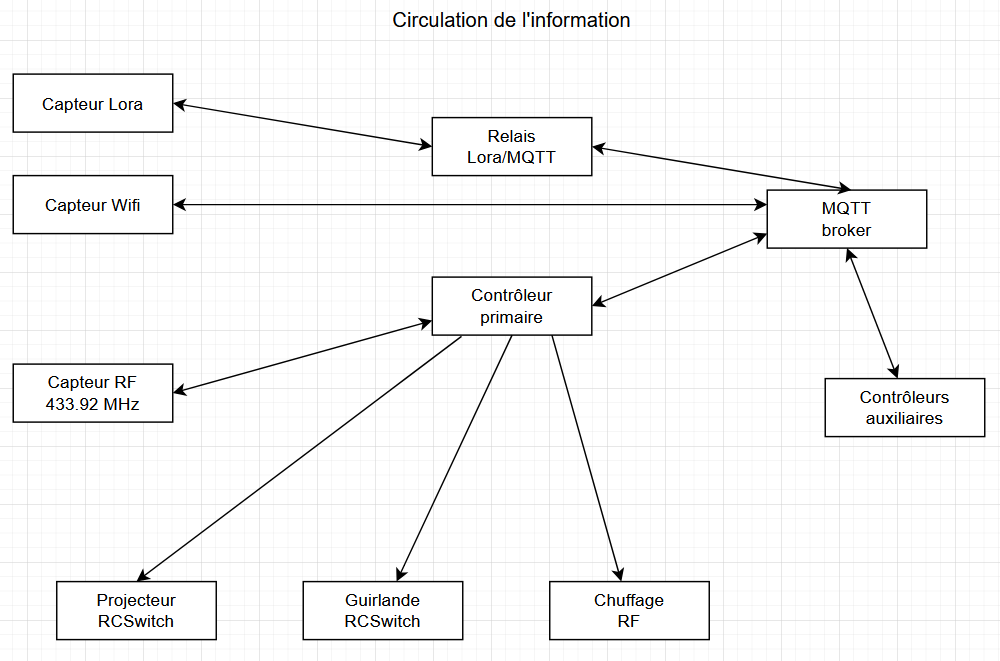
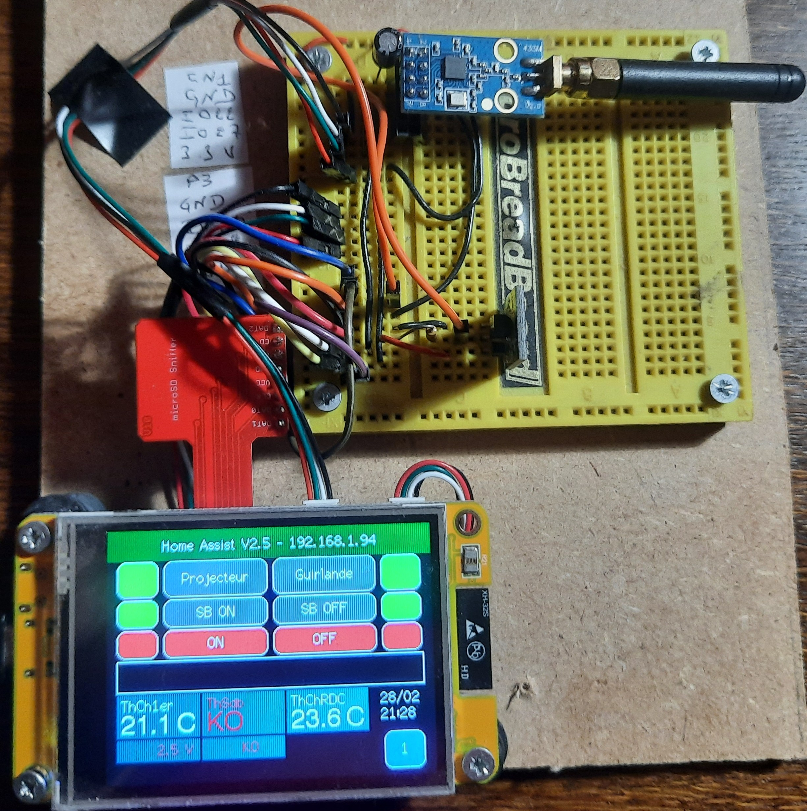
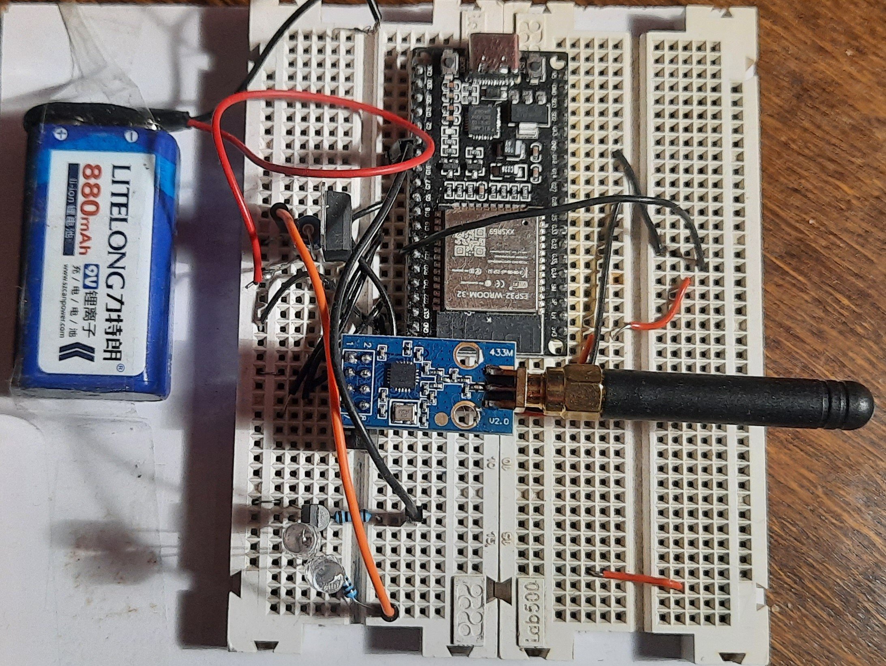
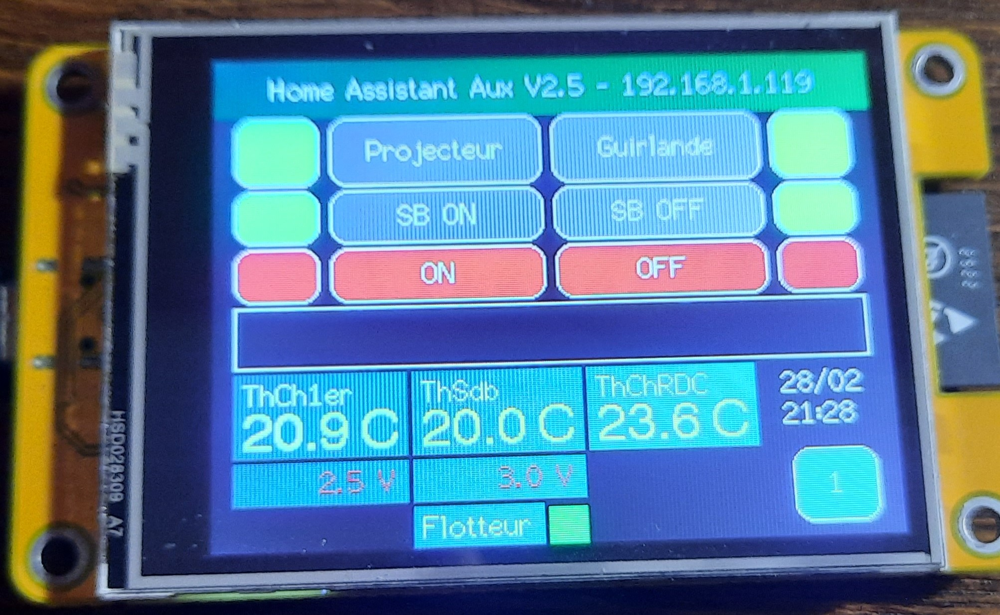
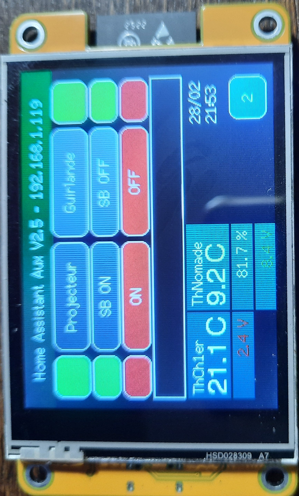
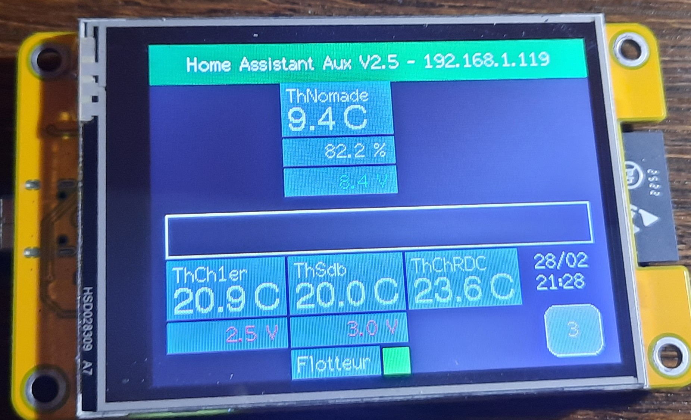
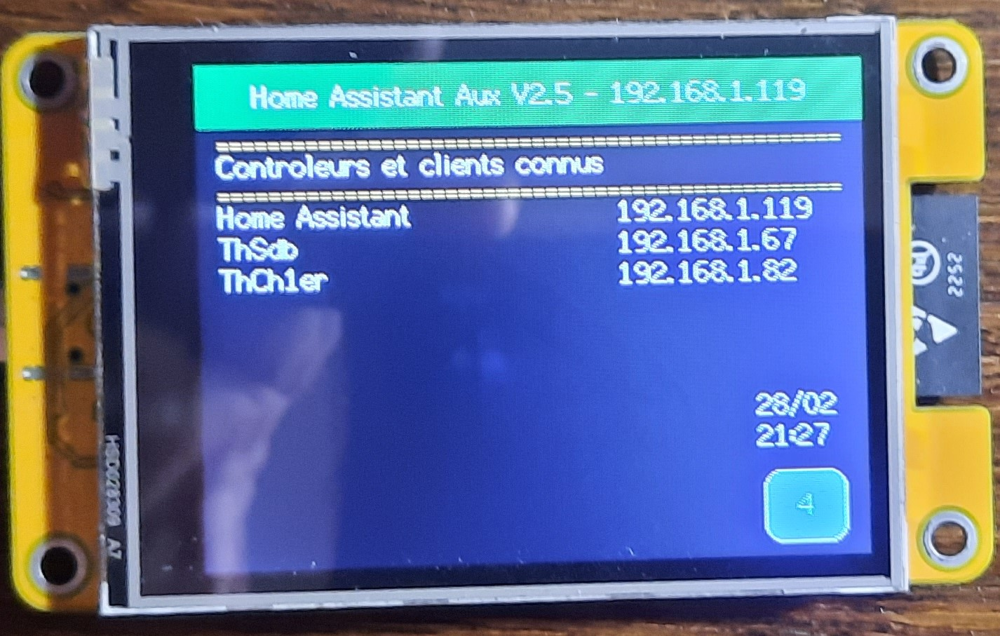
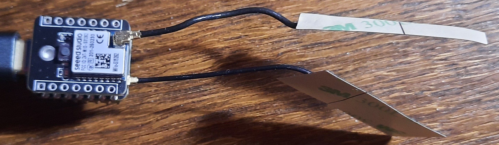
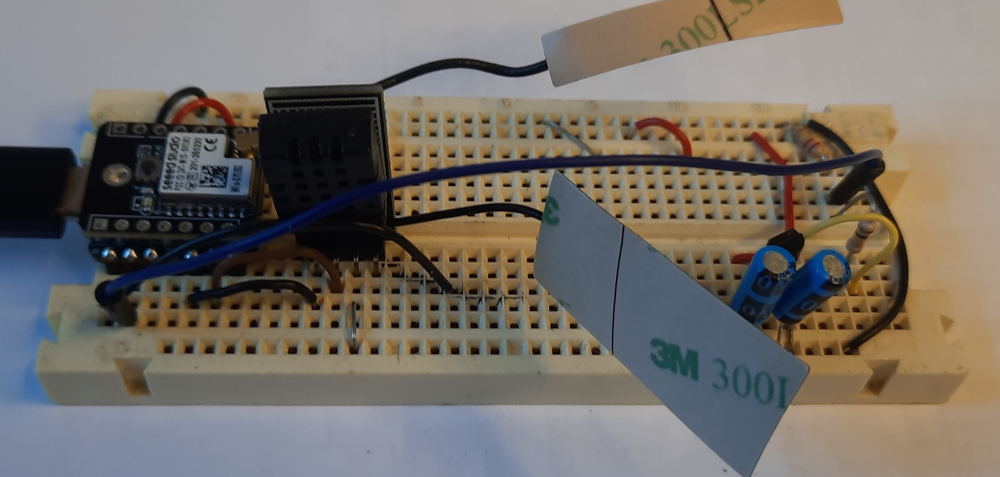

# Home-Assist-ESP32-CYD

Système domotique complet et évolutif basé sur **ESP32** (C3 & S3) avec intégration **LoRa P2P**, **MQTT**, écran tactile **CYD** (Cheap Yellow Display) et capteurs déportés. Visualisation et pilotage das actionneurs par **aplication Androïd**.
Merci à Grok (xAI) pour l’aide sur Riverpod et MQTT entre autre.

## Fonctionnalités principales

- Contrôleur principal avec écran tactile **CYD** (interface locale + MQTT)
- Communication **LoRa P2P** (SX1262) pour longue portée et pénétration (sous-sol, dépendances)
- Ancienne compatibilité **RF 433 MHz** (CC1101)
- Capteurs déportés : température/humidité (**DHT20**), température filaire (**DS18B20**), batterie AA/lithium, tout-ou-rien
- Suivi d'état batterie et alertes faible tension
- Passerelle dédiée **ESP32-S3** (reçoit LoRa → publie MQTT)
- Mode deep-sleep optimisé sur les capteurs (autonomie plusieurs mois sur piles AA)
- Intégration **Home Assistant** via MQTT

## Flux d'information


## Aperçu visuel

### Contrôleur principal (station maître)

| Photo                                          | Description                                                                 |
|------------------------------------------------|-----------------------------------------------------------------------------|
|  | Contrôleur principal équipé de l'écran CYD (interface tactile locale)     |
|  | Même contrôleur principal, version sans écran (montage discret)            |

### Contrôleur auxiliaire (CYD) – écrans disponibles

| Photo                                          | Description                                                                 |
|------------------------------------------------|-----------------------------------------------------------------------------|
|   | Écran principal du contrôleur auxiliaire                                    |
|   | Écran 2 (exemple d'affichage alternatif)                                    |
|   | Écran 3                                                                     |
|   | Écran 4                                                                     |

### Passerelle LoRa → MQTT



Passerelle dédiée basée sur ESP32-S3 qui reçoit les messages LoRa des capteurs et les publie en MQTT.

### Exemple de capteur LoRa P2P



Nœud capteur autonome LoRa P2P avec DHT20 (température + humidité) et détecteur de niveau d'eau (non visible sur cette photo).

## Structure du projet

Home-Assist-ESP32-CYD/
├── Home-Assist/          # Contrôleur principal + CYD (interface MQTT + LoRa gateway)
├── Capteur/              # Tous les nœuds capteurs LoRa (température, batterie, tout-ou-rien)
├── Relais-Lora/          # Passerelle ESP32-S3 LoRa → MQTT
├── images/               # Photos et visuels
├── docs/                 # Schémas, diagrammes, flux d'information (à venir)
├── LICENSE               # MIT
└── README.md             # Ce fichier


Chaque sous-dossier est autonome et contient son propre `platformio.ini`.

## Installation rapide

1. Installer **VS Code** + extension **PlatformIO**
2. Cloner le dépôt :
   ```bash
   git clone https://github.com/jbil-kebir/Home-Assist-ESP32-CYD.git
   
3. Ouvrir un des sous-dossiers dans VS Code (ex: Home-Assist)
4. Sélectionner l’environnement :
esp32c3 → ESP32-C3 Super Mini
esp32s3 → ESP32-S3 (XIAO ou autre)

5. Compiler / flasher :
pio run -e esp32c3
pio run -e esp32c3 --target upload

## Firmwares pré-compilés (v1.0)

Téléchargez les binaires prêts à flasher depuis la release :

→ [Releases / v1.0](https://github.com/jbil-kebir/Home-Assist-ESP32-CYD/releases/tag/v1.0)

- firmware-Controleur-principal-CYD-1.0.bin : Contrôleur principal avec CYD + DS18B20
- firmware-Controleur-principal-sans-CYD-1.0.bin : Contrôleur principal sans CYD
- firmware-Controleur-auxiliaire-CYD-1.0.bin : Contrôleur auxiliaire (CYD seul)

Licence
MIT License – voir le fichier LICENSE
Mots-clés
Domotique, CYD, ESP32, ESP32-C3, ESP32-S3, LoRa, LoRa P2P, SX1262, MQTT, Home Assistant, DHT20, DS18B20, Batterie, Capteur, Passerelle, RF 433 MHz, CC1101

